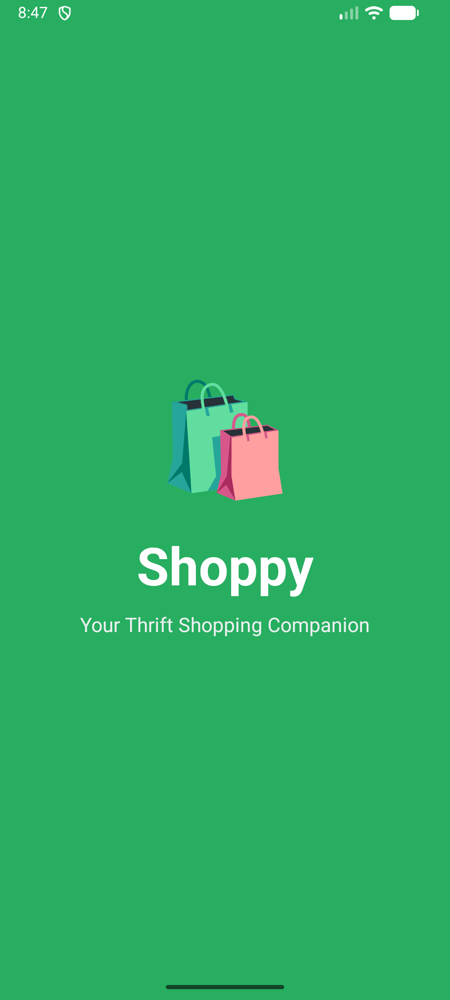
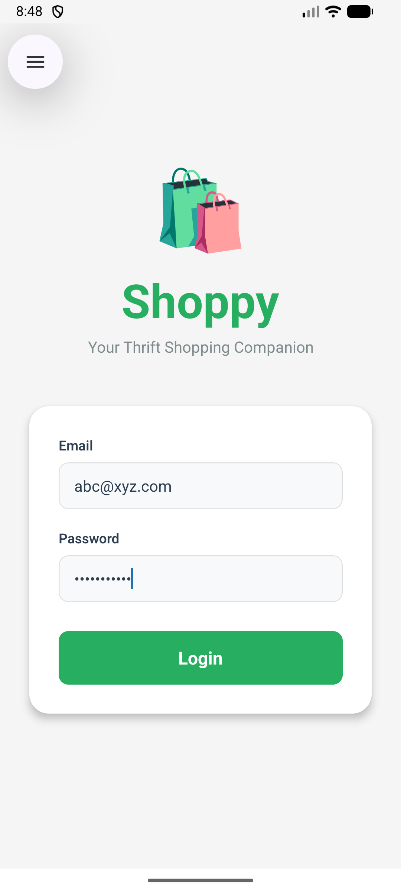
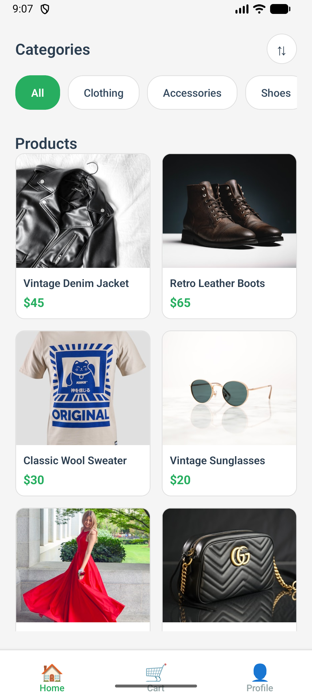
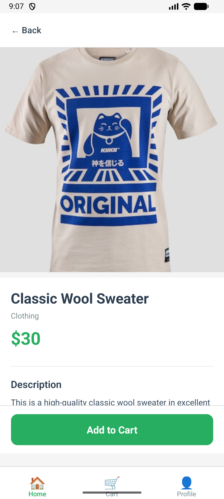
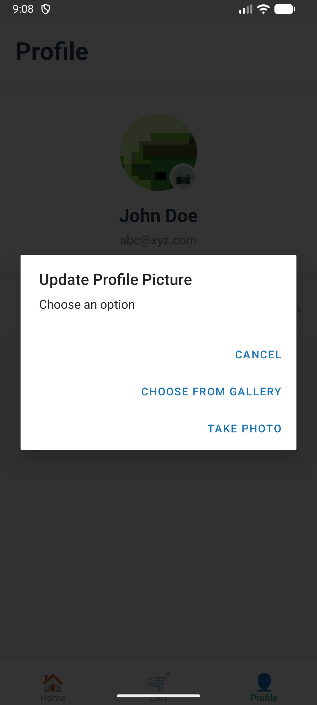
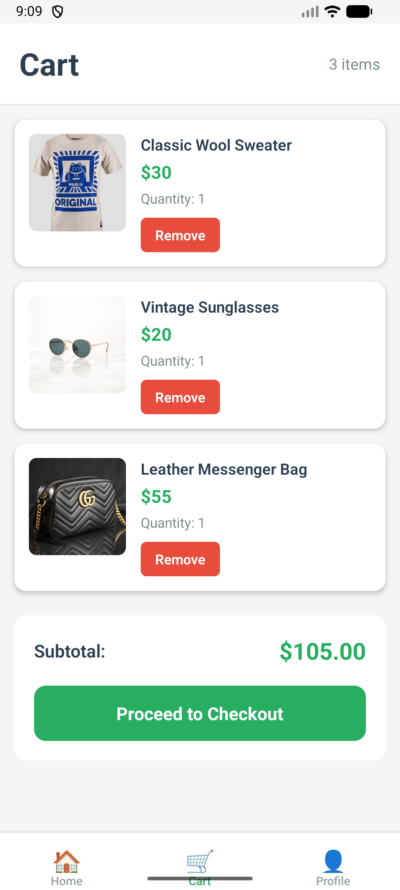

# Shoppy - Full Stack E-Commerce App

A thrift shopping mobile app built with React Native (Expo), Redux Saga, and Node.js/Express backend. Browse products, manage cart, and customize your profile.

## 📸 Screenshots

<p align="center">
  
  
  
</p>

<p align="center">
  
  
  
</p>

## 🚀 Tech Stack

**Frontend:** React Native 0.81.5, Expo ~54.0.30, Redux, Redux Saga, React Navigation  
**Backend:** Node.js, Express.js, CORS enabled  
**Storage:** In-memory (development only)

## ✨ Features

- User authentication (login/logout)
- Product browsing with category filtering
- Price sorting (low to high, high to low)
- Shopping cart with add/remove items
- Profile management with image upload (camera/gallery)
- Splash screen on app launch
- Real-time cart badge counter

## 📦 Installation

1. **Install dependencies**

   ```bash
   npm install
   cd backend && npm install && cd ..
   ```

2. **Start backend server** (port 3000)

   ```bash
   cd backend && npm start
   ```

3. **Start React Native app**
   ```bash
   npm start
   # Press 'a' for Android or 'i' for iOS
   ```

## 🔑 Demo Credentials

```
Email: abc@xyz.com | Password: password123
Email: def@xyz.com | Password: mypassword
```

## 📡 API Endpoints

**Auth:** `POST /api/auth/login`, `POST /api/auth/update-profile`  
**Products:** `GET /api/products`, `GET /api/products/:id`  
**Cart:** `POST /api/cart/add`, `GET /api/cart/:userId`, `DELETE /api/cart/remove`

## 📁 Project Structure

```
thrift-shop/
├── App.js
├── pages/
│   ├── Splash/
│   ├── Login/
│   ├── ProductListing/
│   ├── ProductDetails/
│   ├── Cart/
│   └── Profile/
├── redux/
│   ├── actions/
│   ├── reducers/
│   └── sagas/
└── backend/
    ├── server.js
    ├── routes/
    └── data/
```

## 🔧 Key Technologies

- **State Management:** Redux with Redux Saga for async operations
- **Navigation:** React Navigation (Stack + Bottom Tabs)
- **Image Upload:** Expo Image Picker with base64 encoding
- **API Communication:** Fetch API with saga middleware

## ⚠️ Limitations

- In-memory storage (data resets on server restart)
- Base64 image encoding (not production-ready)
- No database integration
- Android emulator uses `http://10.0.2.2:3000` for localhost access

---

**Built with ❤️ using React Native and Node.js**
